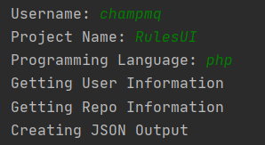

# FakerAlert

A tool to help with finding FakeDeveloper. <br>
**This tool can not tell if someone is a fake developer or not it only helps with analyzing.** <br>
This tool is still in the beta version since there are many things that can get added.

## Installation & Setup
```bash
 $ pip3 install requests flask
 $ git clone https://github.com/champmq/FakerAlert.git
 $ cd FakerAlert
 # For CLI:
 $ python3 FakerAlert.py
 # For RestAPI:
 $ python3 FakerRest.py
```

If you are going to use the tool often you should create a Github App. <br>
Then create a client secret which you can add in `settings.json`

## Usage
You can use it as a RestAPI or as a CLI Tool
<br>
CLI: <br>

<br><br>
RestAPI (Change the port in `settings.json`):
`http://127.0.0.1:1234/name/repo_name/language`

## Output
**How to read the output**
The first part of the output are some infos about the username you entered which also includes all the repos he owns/forked. <br>
The second part is the part for the search of a project which your target claims its his. **If nothing was found, he still can be a Developer.**

<br>

To understand which things are positive and which are not I have a list. <br>
Positiv:
 - Own Repos with some stars/forks/issues
 - Have some followers
 - Is active

<br>

Negative:
 - Many forks with no commits
 - No own repo
 - Inactive

*This list can get updated every time.*


JSON Output: https://pastebin.com/4QYJBdb9

## Questions etc
You can DM me on Discord: champmq#5745 or on [Instagram](https://www.instagram.com/champmq/).
